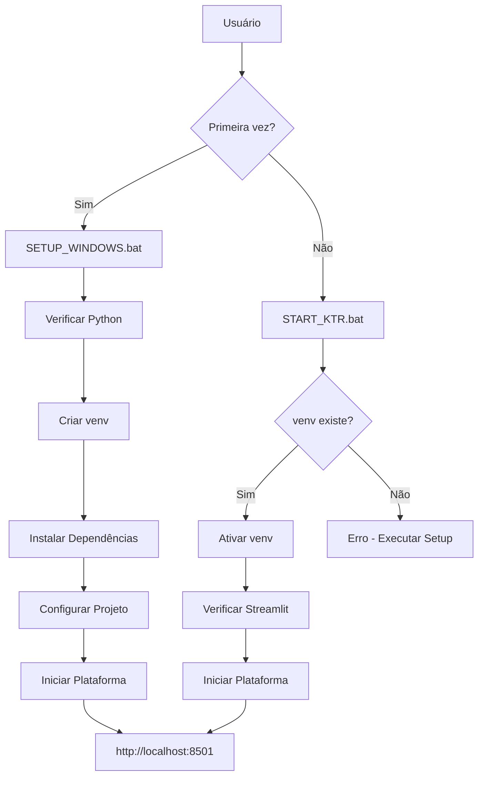

# 🖥️ Solução Windows .BAT - KTR Migrator

## 📋 **Visão Geral**

Implementação de **solução completa em arquivos .BAT** para executar o KTR Migrator Platform em ambientes Windows **sem dependência do Git**, permitindo execução com **apenas 2 cliques**.

---

## 🎯 **Arquivos .BAT Implementados**

### **1. 🔧 SETUP_WINDOWS.bat - Setup Completo**

**Função**: Configuração inicial completa do ambiente
**Execução**: Primeira vez ou após problemas

**Funcionalidades:**
- ✅ Verificação de Python instalado
- ✅ Verificação e instalação do pip
- ✅ Criação de ambiente virtual (venv)
- ✅ Instalação de todas as dependências
- ✅ Verificação da estrutura do projeto
- ✅ Criação de diretórios necessários
- ✅ Configuração de arquivos .env
- ✅ Inicialização automática da plataforma

**Dependências Instaladas:**
```
# Principais
pandas>=2.0.0, sqlalchemy>=2.0.0, psycopg2-binary>=2.9.0
lxml>=4.9.0, xmltodict>=0.13.0, jinja2>=3.1.0

# Plataforma
streamlit>=1.28.0, plotly>=5.17.0, schedule>=1.2.0
psutil>=5.9.0, pymysql>=1.0.0, pyodbc>=4.0.0
```

---

### **2. ⚡ START_KTR.bat - Execução Rápida**

**Função**: Execução diária otimizada após setup inicial
**Execução**: Uso rotineiro

**Funcionalidades:**
- ✅ Verificação de ambiente virtual
- ✅ Ativação do venv
- ✅ Verificação de dependências críticas
- ✅ Abertura automática do navegador
- ✅ Inicialização da plataforma

**Vantagens:**
- 🚀 Execução mais rápida (não reinstala dependências)
- 🌐 Abre navegador automaticamente
- 🔄 Menos verificações (assume ambiente configurado)

---

### **3. 🚀 run_platform.bat - Execução Simples**

**Função**: Execução alternativa mais básica
**Execução**: Alternativa quando ambiente não tem venv

**Funcionalidades:**
- ✅ Verificação básica de Python
- ✅ Instalação de dependências a cada execução
- ✅ Criação de diretórios básicos
- ✅ Inicialização da plataforma

**Características:**
- 📦 Instala dependências a cada execução
- 🔧 Mais lento mas mais confiável
- 🛠️ Não usa ambiente virtual

---

### **4. 🔍 DIAGNOSTICO.bat - Verificação de Problemas**

**Função**: Diagnóstico completo do ambiente
**Execução**: Quando algo não funciona

**Verificações:**
- 🐍 Python instalado e versão
- 📦 pip disponível
- 🏠 Ambiente virtual configurado
- 📁 Estrutura do projeto
- ⚙️ Arquivos de configuração
- 📚 Dependências instaladas
- 🌐 Disponibilidade de portas
- 💾 Recursos do sistema

---

### **5. 🔄 RESET_AMBIENTE.bat - Reset Completo**

**Função**: Limpeza e reset do ambiente em casos críticos
**Execução**: Quando ambiente está corrompido

**Funcionalidades:**
- 🗑️ Remove ambiente virtual
- 🧽 Limpa cache Python (__pycache__)
- 🧹 Remove arquivos temporários (.pyc, .pyo)
- 📋 Opção de limpar logs
- 🔄 Opção de executar setup automaticamente

---

## 🏗️ **Arquitetura da Solução**

### **Fluxo de Execução:**



### **Estrutura de Arquivos:**

```
ktr_migrator/
├── 🔧 SETUP_WINDOWS.bat         # Setup completo
├── ⚡ START_KTR.bat             # Execução rápida
├── 🚀 run_platform.bat         # Execução simples
├── 🔍 DIAGNOSTICO.bat          # Diagnóstico
├── 🔄 RESET_AMBIENTE.bat       # Reset ambiente
├── 📖 LEIA-ME_WINDOWS.md       # Guia do usuário
├── 📁 venv/                    # Ambiente virtual (criado)
├── 📁 ktr_platform/            # Aplicação
│   ├── 📱 app.py               # Interface Streamlit
│   ├── ⚙️ .env                 # Configurações (criado)
│   ├── 📊 data/                # Dados (criado)
│   │   ├── flows.json          # Metadados flows
│   │   └── schedules.json      # Agendamentos
│   └── 📋 logs/                # Logs (criado)
└── 📚 docs/desenvolvimento/    # Documentação técnica
```

---

## 🛠️ **Implementação Técnica**

### **Tratamento de Erros:**

Todos os scripts implementam:
- ✅ Verificação de exit codes
- ✅ Mensagens de erro claras
- ✅ Sugestões de solução
- ✅ Fallbacks para problemas comuns

### **Codificação e Encoding:**

```batch
@echo off
chcp 65001 >nul  # UTF-8 para suporte a emojis e acentos
```

### **Interface Visual:**

```batch
color 0A          # Verde para setup
color 0B          # Azul para execução rápida  
color 0C          # Vermelho para execução simples
color 0E          # Amarelo para diagnóstico
```

### **Configuração Automática:**

O `SETUP_WINDOWS.bat` cria automaticamente:

```ini
# .env gerado automaticamente
APP_NAME=KTR Platform Pro
APP_VERSION=1.0.0
DEBUG=false
HOST=localhost
PORT=8501
DATABASE_TYPE=postgresql
# ... mais configurações
```

---

## 🎯 **Casos de Uso**

### **1. 🏢 Ambiente Corporativo (Sem Git)**
```
Cenário: Máquina corporativa restrita
Solução: SETUP_WINDOWS.bat + START_KTR.bat
Benefício: Independência total de ferramentas dev
```

### **2. 👥 Usuário Não-Técnico**
```
Cenário: Usuário quer apenas executar
Solução: Clique duplo em START_KTR.bat
Benefício: Zero configuração manual
```

### **3. 🔧 Ambiente de Testes**
```
Cenário: Múltiplos testes e resets
Solução: RESET_AMBIENTE.bat + SETUP_WINDOWS.bat
Benefício: Reset rápido e confiável
```

### **4. 🚨 Solução de Problemas**
```
Cenário: Algo não funciona
Solução: DIAGNOSTICO.bat
Benefício: Diagnóstico automático completo
```

---

## 📊 **Métricas e Performance**

### **Tempos de Execução:**

| **Script** | **Primeira Execução** | **Execuções Subsequentes** |
|------------|------------------------|----------------------------|
| SETUP_WINDOWS.bat | ~3-5 minutos | ~2-3 minutos |
| START_KTR.bat | N/A | ~15-30 segundos |
| run_platform.bat | ~1-2 minutos | ~1-2 minutos |
| DIAGNOSTICO.bat | N/A | ~10-15 segundos |

### **Consumo de Recursos:**

- 💾 **Espaço**: ~200MB (venv + dependências)
- 🧠 **RAM**: ~50-100MB (durante instalação)
- 🌐 **Rede**: ~50MB (download de pacotes)

---

## 🔐 **Segurança e Boas Práticas**

### **Ambiente Virtual:**
- ✅ Isolamento de dependências
- ✅ Não poluição do Python global
- ✅ Fácil limpeza e reset

### **Configurações:**
- ✅ Arquivo .env para secrets
- ✅ Configurações padrão seguras
- ✅ Debug desabilitado por padrão

### **Validações:**
- ✅ Verificação de integridade dos arquivos
- ✅ Validação de versões mínimas
- ✅ Verificação de permissões

---

## 🚀 **Vantagens da Solução**

### **Para o Usuário:**
- 🎯 **2 cliques** para executar
- 🚫 **Sem Git** necessário
- 🔄 **Setup automático**
- 🌐 **Navegador abre** automaticamente
- 🔧 **Diagnóstico** integrado

### **Para o Desenvolvedor:**
- 📦 **Distribuição simples**
- 🛠️ **Manutenção fácil**
- 📋 **Logs detalhados**
- 🔍 **Debug simplificado**

### **Para a Enterprise:**
- 🏢 **Compliance** com ambientes restritos
- 🔐 **Sem dependências** externas
- 📊 **Controle total** do ambiente
- 🎯 **Deploy** simplificado

---

## 🔮 **Extensões Futuras**

### **Melhorias Planejadas:**
- 🔄 **Auto-update** via .bat
- 📊 **Métricas** de uso
- 🔔 **Notificações** Windows
- 🎨 **Interface gráfica** opcional
- ☁️ **Deploy cloud** via .bat

### **Integrações:**
- 🐳 **Docker Desktop** (se disponível)
- 💾 **SQL Server** local
- 📱 **Mobile** via ngrok

---

## 📞 **Suporte e Troubleshooting**

### **Problemas Comuns:**

1. **Python não encontrado**: Instalar + Add to PATH
2. **Pip não funciona**: python -m ensurepip --upgrade
3. **Porta ocupada**: Modificar porta nos scripts
4. **Permissões**: Executar como administrador
5. **Antivírus**: Adicionar exceção para pasta do projeto

### **Logs de Debug:**
- 📋 `ktr_platform/logs/platform.log`
- 🔍 Configure `DEBUG=true` no .env
- 📊 Use `DIAGNOSTICO.bat` para análise

---

## ✅ **Conclusão**

A solução .BAT implementada oferece:

- 🎯 **Execução com 2 cliques**
- 🚫 **Independência do Git**
- 🔧 **Setup completamente automatizado**
- 🔍 **Diagnóstico integrado**
- 🛠️ **Manutenção simplificada**

**Resultado**: Plataforma KTR 100% funcional em qualquer ambiente Windows com apenas Python instalado. 