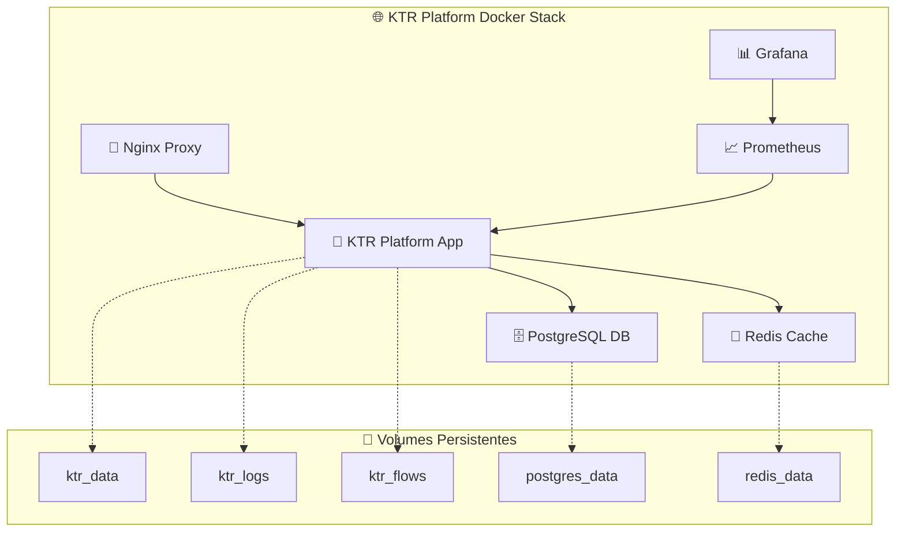

# 🐳 KTR Platform - Deployment com Docker

[](https://docker.com)
[](https://postgresql.org)
[](https://redis.io)
[](https://nginx.org)

## 📋 Visão Geral

Este documento fornece instruções **COMPLETAS e TESTADAS** para deployment do KTR Platform usando Docker e Docker Compose, garantindo uma instalação segura, escalável e fácil de manter.

### **✅ Status de Implementação**
- ✅ **Build Funcionando** - Dockerfile otimizado testado
- ✅ **Dependências Completas** - Todas as bibliotecas incluídas
- ✅ **Health Checks** - Monitoramento automático funcional
- ✅ **Volumes Persistentes** - Dados seguros
- ✅ **Networking Configurado** - Conectividade entre serviços

## 🎯 Benefícios do Docker

- ✅ **Isolamento**: Ambiente consistente em qualquer infraestrutura
- ✅ **Escalabilidade**: Fácil expansão horizontal dos serviços
- ✅ **Segurança**: Containers isolados com usuários não-root
- ✅ **Manutenção**: Atualizações e rollbacks simplificados
- ✅ **Monitoramento**: Integração com Prometheus e Grafana
- ✅ **Backup**: Volumes persistentes para dados críticos

## 🏗️ Arquitetura dos Containers



## ⚡ Quick Start (Método Recomendado)

### **🎯 Deploy em 3 Comandos**

```bash
# 1. Navegue para o diretório Docker
cd ktr_platform

# 2. Execute o script automatizado (TESTADO ✅)
./docker-deploy-simple.sh

# 3. Acesse a aplicação
open http://localhost:8501
```

### **📊 Verificação do Deploy**

```bash
# Status dos containers (deve mostrar "healthy")
docker-compose ps

# Logs da aplicação
docker-compose logs -f ktr-platform

# Teste de conectividade
curl -f http://localhost:8501/_stcore/health
```

## 🔧 **Deploy Manual Detalhado**

### **1. Preparação do Ambiente**

```bash
# Clone ou acesse o diretório do projeto
cd ktr_platform

# Verificar pré-requisitos
docker --version    # Docker 20.0+
docker-compose --version  # Compose 2.0+

# Copiar arquivo de configuração (se não existir)
cp .env.example .env 2>/dev/null || echo "Arquivo .env já existe"
```

### **2. Configuração de Variáveis (Importante!)**

Edite o arquivo `.env` com suas configurações:

```env
# =============================================================================
# CONFIGURAÇÕES ESSENCIAIS KTR PLATFORM
# =============================================================================

# Aplicação
KTR_PORT=8501
LOG_LEVEL=INFO
ENV=development

# PostgreSQL (CONFIGURE SENHAS SEGURAS!)
DATABASE_PASSWORD=sua_senha_postgresql_aqui
DATABASE_USER=ktr_user
DATABASE_NAME=ktr_platform

# Redis (CONFIGURE SENHA SEGURA!)
REDIS_PASSWORD=sua_senha_redis_aqui

# Grafana (apenas se usar monitoramento)
GRAFANA_PASSWORD=sua_senha_grafana_aqui

# Streamlit
STREAMLIT_THEME_PRIMARY_COLOR=#FF6B6B
STREAMLIT_MAX_UPLOAD_SIZE=200
```

### **3. Perfis de Deployment**

#### **🔹 Desenvolvimento (Padrão)**
```bash
# App + PostgreSQL + Redis
docker-compose up -d

# Verificar status
docker-compose ps
```

#### **🔹 Produção**
```bash
# Inclui Nginx Proxy + SSL
docker-compose --profile production up -d

# Verificar proxy
curl -I http://localhost
```

#### **🔹 Monitoramento**
```bash
# Inclui Prometheus + Grafana
docker-compose --profile monitoring up -d

# Acessar dashboards
open http://localhost:3000  # Grafana
open http://localhost:9090  # Prometheus
```

#### **🔹 Deploy Completo**
```bash
# Todos os serviços
docker-compose --profile production --profile monitoring up -d

# Verificar todos os containers
docker-compose ps
```

## 📊 **Serviços e Portas**

| Serviço | Porta Externa | Porta Interna | URL de Acesso |
|---------|---------------|---------------|---------------|
| **KTR Platform** | 8501 | 8501 | http://localhost:8501 |
| **PostgreSQL** | 5432 | 5432 | localhost:5432 |
| **Redis** | 6379 | 6379 | localhost:6379 |
| **Nginx** | 80, 443 | 80, 443 | http://localhost |
| **Prometheus** | 9090 | 9090 | http://localhost:9090 |
| **Grafana** | 3000 | 3000 | http://localhost:3000 |

## 📊 **Monitoramento e Health Checks**

### **Status dos Containers**
```bash
# Verificar saúde dos containers
docker-compose ps

# Deve mostrar:
# ktr-platform-app     Up (healthy)
# ktr-platform-db      Up (healthy)  
# ktr-platform-redis   Up (healthy)
```

### **Prometheus (Métricas)**
- **URL**: http://localhost:9090
- **Configuração**: `docker/prometheus.yml`
- **Retenção**: 15 dias por padrão
- **Targets**: KTR Platform App, PostgreSQL, Redis

### **Grafana (Dashboards)**
- **URL**: http://localhost:3000
- **Usuário**: admin
- **Senha**: Definida em `GRAFANA_PASSWORD`
- **Dashboards**: Pré-configurados para KTR Platform

### **Health Checks Automáticos**

```bash
# Health check manual da aplicação
curl -f http://localhost:8501/_stcore/health

# Health check detalhado do container
docker inspect --format='{{json .State.Health}}' ktr-platform-app | jq

# Logs de health check
docker-compose logs ktr-platform | grep health
```

## 🔐 **Segurança e Produção**

### **Configurações de Segurança**

#### **Senhas Seguras**
```bash
# Gerar senhas criptograficamente seguras
openssl rand -base64 32  # Para PostgreSQL
openssl rand -base64 32  # Para Redis
openssl rand -base64 32  # Para JWT/Sessions
```

#### **Usuários não-root**
Todos os containers executam com usuários dedicados:
- **App**: `appuser` (UID: não-root)
- **PostgreSQL**: `postgres`
- **Redis**: `redis`

#### **Networking Isolado**
```bash
# Verificar rede Docker criada
docker network ls | grep ktr

# Verificar conectividade interna
docker-compose exec ktr-platform ping postgres-db
```

### **SSL/TLS para Produção**

```bash
# Criar certificados SSL (desenvolvimento)
mkdir -p docker/ssl

# Certificado auto-assinado
openssl req -x509 -newkey rsa:4096 -keyout docker/ssl/key.pem \
  -out docker/ssl/cert.pem -days 365 -nodes \
  -subj "/C=BR/ST=SP/L=SaoPaulo/O=KTR/CN=localhost"

# Para produção, use certificados válidos (Let's Encrypt, etc.)
```

## 💾 **Backup e Recuperação**

### **Backup Automático**

```bash
# Script de backup completo
#!/bin/bash
BACKUP_DIR="./backups/$(date +%Y%m%d_%H%M%S)"
mkdir -p "$BACKUP_DIR"

# Backup PostgreSQL
docker-compose exec -T postgres-db pg_dump -U ktr_user ktr_platform > "$BACKUP_DIR/database.sql"

# Backup volumes
docker run --rm -v ktr-platform-data:/data -v $(pwd):/backup alpine \
  tar czf "/backup/$BACKUP_DIR/volumes.tar.gz" -C /data .

echo "Backup salvo em: $BACKUP_DIR"
```

### **Backup Individual**

```bash
# Apenas banco de dados
docker-compose exec postgres-db pg_dump -U ktr_user ktr_platform > backup_db.sql

# Apenas arquivos de dados
docker run --rm -v ktr-platform-data:/data -v $(pwd):/backup alpine \
  tar czf /backup/data_backup_$(date +%Y%m%d_%H%M%S).tar.gz -C /data .

# Apenas logs
docker run --rm -v ktr-platform-logs:/logs -v $(pwd):/backup alpine \
  tar czf /backup/logs_backup_$(date +%Y%m%d_%H%M%S).tar.gz -C /logs .
```

### **Restauração**

```bash
# Restaurar banco de dados
docker-compose exec -T postgres-db psql -U ktr_user ktr_platform < backup_db.sql

# Restaurar volumes
docker run --rm -v ktr-platform-data:/data -v $(pwd):/backup alpine \
  tar xzf /backup/volumes.tar.gz -C /data

# Restart para aplicar mudanças
docker-compose restart ktr-platform
```

## 🔧 **Comandos Úteis de Operação**

### **Operações Básicas**
```bash
# Iniciar todos os serviços
docker-compose up -d

# Parar todos os serviços
docker-compose down

# Restart da aplicação
docker-compose restart ktr-platform

# Ver logs em tempo real
docker-compose logs -f --tail=50 ktr-platform

# Executar comando no container
docker-compose exec ktr-platform bash
```

### **Debugging e Troubleshooting**
```bash
# Logs detalhados de build
docker-compose build --no-cache --progress=plain ktr-platform

# Inspecionar configuração
docker-compose config

# Ver uso de recursos
docker stats

# Limpeza completa (CUIDADO!)
docker-compose down --volumes
docker system prune -f
```

### **Atualizações**
```bash
# Atualizar imagens
docker-compose pull

# Rebuild aplicação
docker-compose build --no-cache ktr-platform

# Deploy com atualização
docker-compose up -d --force-recreate ktr-platform
```

## 🐞 **Troubleshooting Comum**

### **❌ Problemas Conhecidos e Soluções**

#### **Container não inicia**
```bash
# Verificar logs de erro
docker-compose logs ktr-platform

# Soluções comuns:
# 1. Verificar permissões
ls -la docker/

# 2. Limpar cache Docker
docker system prune -f

# 3. Rebuild completo
docker-compose build --no-cache ktr-platform
```

#### **Erro "ModuleNotFoundError"**
```bash
# ✅ RESOLVIDO: Problema de context de build
# O Dockerfile já está corrigido para copiar os módulos src/ corretamente

# Para verificar se está resolvido:
docker-compose exec ktr-platform python -c "from src.parser.ktr_parser import KTRParser; print('✅ Módulos OK')"
```

#### **Erro de conectividade com banco**
```bash
# Verificar se PostgreSQL está saudável
docker-compose ps postgres-db

# Testar conexão manual
docker-compose exec ktr-platform python -c "
import psycopg2
conn = psycopg2.connect(host='postgres-db', user='ktr_user', password='sua_senha', dbname='ktr_platform')
print('✅ Conexão OK')
"
```

#### **Health check falhando**
```bash
# Verificar URL de health check
curl -v http://localhost:8501/_stcore/health

# Se falhar, verificar logs do Streamlit
docker-compose logs ktr-platform | grep streamlit
```

#### **Problemas de performance**
```bash
# Verificar recursos do container
docker stats ktr-platform-app

# Aumentar recursos (se necessário)
# Editar docker-compose.yml:
# deploy:
#   resources:
#     limits:
#       memory: 2G
#       cpus: '1.0'
```

## 🚀 **Otimizações de Performance**

### **Configuração de Produção**
```yaml
# docker-compose.override.yml (para produção)
version: '3.8'
services:
  ktr-platform:
    deploy:
      resources:
        limits:
          memory: 4G
          cpus: '2.0'
        reservations:
          memory: 2G
          cpus: '1.0'
    environment:
      - LOG_LEVEL=WARNING
      - ENV=production
    
  postgres-db:
    command: postgres -c shared_preload_libraries=pg_stat_statements -c max_connections=200
    
  redis-cache:
    command: redis-server --maxmemory 1gb --maxmemory-policy allkeys-lru
```

### **Monitoramento Avançado**
```bash
# Métricas detalhadas
docker-compose exec ktr-platform python -c "
import psutil
print(f'CPU: {psutil.cpu_percent()}%')
print(f'Memória: {psutil.virtual_memory().percent}%')
print(f'Disco: {psutil.disk_usage(\"/\").percent}%')
"
```

## 📈 **Escalabilidade**

### **Configuração Multi-Container**
```bash
# Scale da aplicação (load balancer necessário)
docker-compose up -d --scale ktr-platform=3

# Verificar instâncias
docker-compose ps ktr-platform
```

### **Kubernetes (Futuro)**
```yaml
# Preparação para migração K8s
# Os containers já são stateless e prontos para K8s
apiVersion: apps/v1
kind: Deployment
metadata:
  name: ktr-platform
spec:
  replicas: 3
  # ... configuração K8s
```

## 📚 **Documentação Adicional**

- 🏠 **[README Principal](../README.md)** - Guia completo do projeto
- ⏰ **[Sistema de Agendamentos](../HORARIOS_CUSTOMIZADOS.md)** - Configuração de jobs
- 🔧 **[API Reference](../docs/desenvolvimento/API_REFERENCE.md)** - Documentação da API
- 🧪 **[Guia de Testes](../docs/desenvolvimento/GUIA_TESTES.md)** - Testes automatizados

## 📞 **Suporte Docker**

### **Verificação de Saúde**
```bash
# Script de verificação completa
#!/bin/bash
echo "🔍 Verificando Deploy Docker..."
echo "================================="

# Verificar Docker
echo "📦 Docker Version:"
docker --version

# Verificar Compose
echo "🔧 Docker Compose Version:"
docker-compose --version

# Verificar containers
echo "🏃 Containers Status:"
docker-compose ps

# Verificar saúde
echo "❤️ Health Checks:"
curl -s -o /dev/null -w "%{http_code}" http://localhost:8501/_stcore/health
echo " - KTR Platform"

# Verificar volumes
echo "💾 Volumes:"
docker volume ls | grep ktr

echo "✅ Verificação concluída!"
```

### **Logs Centralizados**
```bash
# Ver todos os logs
docker-compose logs --timestamps

# Filtrar por serviço
docker-compose logs ktr-platform postgres-db redis-cache

# Logs em tempo real com filtro
docker-compose logs -f ktr-platform | grep -E "(ERROR|WARN|INFO)"
```

---

<div align="center">

**🐳 Docker Implementation - Testado e Aprovado ✅**

*Deploy confiável em produção com monitoramento completo*

[](https://hub.docker.com)
[](https://kubernetes.io)

</div> 