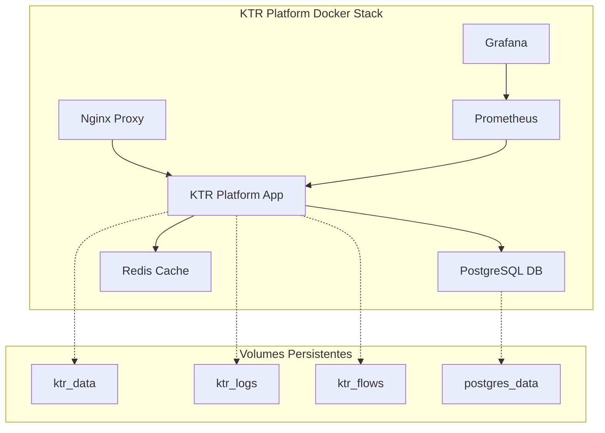

# 🐳 KTR Platform - Deployment com Docker

## 📋 Visão Geral

Este documento fornece instruções completas para deployment do KTR Platform usando Docker e Docker Compose, garantindo uma instalação segura, escalável e fácil de manter.

## 🎯 Benefícios do Docker

- ✅ **Isolamento**: Ambiente consistente em qualquer infraestrutura
- ✅ **Escalabilidade**: Fácil expansão horizontal dos serviços
- ✅ **Segurança**: Containers isolados com usuários não-root
- ✅ **Manutenção**: Atualizações e rollbacks simplificados
- ✅ **Monitoramento**: Integração com Prometheus e Grafana
- ✅ **Backup**: Volumes persistentes para dados críticos

## 🏗️ Arquitetura dos Containers



## ⚡ Quick Start

### 1. Preparação do Ambiente

```bash
# Clone ou acesse o diretório do projeto
cd ktr_platform

# Copiar arquivo de configuração
cp .env.example .env

# Editar configurações (importante!)
nano .env
```

### 2. Configuração Básica

Edite o arquivo `.env` com suas configurações:

```env
# Configurações essenciais
KTR_PORT=8501
DB_PASSWORD=sua_senha_segura_aqui
REDIS_PASSWORD=sua_senha_redis_aqui
GRAFANA_PASSWORD=sua_senha_grafana_aqui
```

### 3. Inicialização

```bash
# Desenvolvimento (apenas app + banco)
docker-compose up -d

# Produção (com proxy reverso)
docker-compose --profile production up -d

# Com monitoramento (Prometheus + Grafana)
docker-compose --profile monitoring up -d
```

### 4. Verificação

```bash
# Status dos containers
docker-compose ps

# Logs da aplicação
docker-compose logs -f ktr-platform

# Acessar aplicação
open http://localhost:8501
```

## 🔧 Configurações Detalhadas

### Variáveis de Ambiente Principais

| Variável | Padrão | Descrição |
|----------|--------|-----------|
| `KTR_PORT` | 8501 | Porta da aplicação |
| `DB_PASSWORD` | - | **Obrigatório** - Senha do PostgreSQL |
| `REDIS_PASSWORD` | - | **Obrigatório** - Senha do Redis |
| `LOG_LEVEL` | INFO | Nível de log (DEBUG, INFO, WARNING, ERROR) |
| `ENV` | development | Ambiente (development, staging, production) |

### Perfis de Deployment

#### 🔹 Desenvolvimento (Padrão)
```bash
docker-compose up -d
```
**Inclui**: App principal + PostgreSQL + Redis

#### 🔹 Produção
```bash
docker-compose --profile production up -d
```
**Inclui**: Desenvolvimento + Nginx Proxy + SSL/TLS

#### 🔹 Monitoramento
```bash
docker-compose --profile monitoring up -d
```
**Inclui**: Desenvolvimento + Prometheus + Grafana

#### 🔹 Completo
```bash
docker-compose --profile production --profile monitoring up -d
```
**Inclui**: Todos os serviços

## 📊 Monitoramento

### Prometheus (Métricas)
- **URL**: http://localhost:9090
- **Configuração**: `docker/prometheus.yml`
- **Retenção**: 15 dias por padrão

### Grafana (Dashboards)
- **URL**: http://localhost:3000
- **Usuário**: admin
- **Senha**: Definida em `GRAFANA_PASSWORD`

### Health Checks

Todos os containers possuem health checks automáticos:

```bash
# Verificar saúde dos containers
docker-compose ps

# Logs de health check
docker inspect --format='{{json .State.Health}}' ktr-platform-app
```

## 🔐 Segurança

### Usuários não-root
Todos os containers executam com usuários dedicados:
- App: `ktruser` (UID: não-root)
- PostgreSQL: `postgres`
- Redis: `redis`

### Secrets Management
```bash
# Gerar senhas seguras
openssl rand -base64 32  # Para PostgreSQL
openssl rand -base64 32  # Para Redis
openssl rand -base64 32  # Para JWT
```

### SSL/TLS (Produção)
```bash
# Criar certificados SSL
mkdir -p docker/ssl

# Certificado auto-assinado (desenvolvimento)
openssl req -x509 -newkey rsa:4096 -keyout docker/ssl/key.pem \
  -out docker/ssl/cert.pem -days 365 -nodes

# Para produção, use certificados válidos (Let's Encrypt, etc.)
```

## 💾 Backup e Recuperação

### Backup dos Dados

```bash
# Script de backup completo
./docker/scripts/backup.sh

# Backup manual do PostgreSQL
docker-compose exec postgres-db pg_dump -U ktr_user ktr_platform > backup_$(date +%Y%m%d_%H%M%S).sql

# Backup dos volumes
docker run --rm -v ktr-platform-data:/data -v $(pwd):/backup alpine \
  tar czf /backup/ktr_data_backup_$(date +%Y%m%d_%H%M%S).tar.gz -C /data .
```

### Restauração

```bash
# Restaurar PostgreSQL
docker-compose exec -T postgres-db psql -U ktr_user ktr_platform < backup_file.sql

# Restaurar volumes
docker run --rm -v ktr-platform-data:/data -v $(pwd):/backup alpine \
  tar xzf /backup/ktr_data_backup.tar.gz -C /data
```

## 🚀 Comandos de Gerenciamento

### Controle dos Serviços

```bash
# Iniciar todos os serviços
docker-compose up -d

# Parar todos os serviços
docker-compose down

# Reiniciar serviço específico
docker-compose restart ktr-platform

# Atualizar imagem e reiniciar
docker-compose pull ktr-platform
docker-compose up -d ktr-platform

# Ver logs em tempo real
docker-compose logs -f

# Logs de serviço específico
docker-compose logs -f ktr-platform
```

### Manutenção

```bash
# Limpeza de containers parados
docker system prune

# Limpeza de volumes não utilizados
docker volume prune

# Rebuild completo
docker-compose down
docker-compose build --no-cache
docker-compose up -d
```

### Acesso aos Containers

```bash
# Shell no container principal
docker-compose exec ktr-platform bash

# Shell no PostgreSQL
docker-compose exec postgres-db psql -U ktr_user ktr_platform

# Shell no Redis
docker-compose exec redis-cache redis-cli -a $REDIS_PASSWORD
```

## 📈 Escalabilidade

### Múltiplas Instâncias

```yaml
# docker-compose.override.yml
version: '3.8'
services:
  ktr-platform:
    deploy:
      replicas: 3
    ports:
      - "8501-8503:8501"
```

### Load Balancer

```bash
# Usar com nginx-proxy-manager ou Traefik
# Configurar labels apropriadas no docker-compose.yml
```

## 🛠️ Troubleshooting

### Problemas Comuns

#### Container não inicia
```bash
# Verificar logs
docker-compose logs ktr-platform

# Verificar configuração
docker-compose config

# Verificar saúde
docker-compose ps
```

#### Erro de permissão
```bash
# Verificar ownership dos volumes
docker-compose exec ktr-platform ls -la /app/data

# Corrigir permissões
docker-compose exec ktr-platform chown -R ktruser:ktruser /app/data
```

#### Banco não conecta
```bash
# Verificar se o PostgreSQL está rodando
docker-compose exec postgres-db pg_isready

# Testar conexão
docker-compose exec ktr-platform pg_isready -h postgres-db -U ktr_user
```

### Logs Detalhados

```bash
# Ativar debug
echo "LOG_LEVEL=DEBUG" >> .env
docker-compose restart ktr-platform

# Verificar logs do sistema
docker-compose exec ktr-platform tail -f /app/logs/platform/*.log
```

## 🔄 CI/CD

### GitHub Actions Example

```yaml
# .github/workflows/deploy.yml
name: Deploy KTR Platform
on:
  push:
    branches: [main]

jobs:
  deploy:
    runs-on: ubuntu-latest
    steps:
      - uses: actions/checkout@v3
      - name: Deploy to production
        run: |
          docker-compose --profile production pull
          docker-compose --profile production up -d
```

### Atualizações Automatizadas

```bash
# Script de atualização
#!/bin/bash
set -e

echo "🔄 Atualizando KTR Platform..."

# Backup antes da atualização
./docker/scripts/backup.sh

# Pull das novas imagens
docker-compose pull

# Restart com zero downtime
docker-compose up -d

echo "✅ Atualização concluída!"
```

## 📞 Suporte

### URLs de Acesso (Padrão)

- **Aplicação Principal**: http://localhost:8501
- **PostgreSQL**: localhost:5432
- **Redis**: localhost:6379
- **Prometheus**: http://localhost:9090
- **Grafana**: http://localhost:3000

### Logs Importantes

```bash
# Aplicação
docker-compose logs -f ktr-platform

# Banco de dados
docker-compose logs -f postgres-db

# Proxy (produção)
docker-compose logs -f nginx-proxy
```

### Recursos Úteis

- 📚 **Documentação Docker**: https://docs.docker.com/
- 📚 **Docker Compose**: https://docs.docker.com/compose/
- 🔧 **PostgreSQL**: https://www.postgresql.org/docs/
- 📊 **Prometheus**: https://prometheus.io/docs/
- 📈 **Grafana**: https://grafana.com/docs/

---

**Desenvolvido em**: 2025-06-19  
**Versão**: 1.0  
**Engenheiro Responsável**: Engenheiro de Dados Senior 